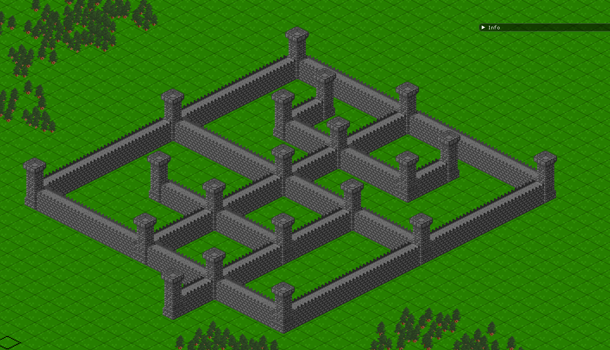

# HopCity

Isometric defo not sim city building game


## Screenshots



## Thanks

[Michael Kirsch](https://github.com/MichaelKirsch) -> Profiler

[Joco223](https://github.com/Joco223) -> Stone wall textures

## Building + Running

### Windows (Clion)

_only tested with mingw 7.3.0_

Clone this repository and create a `libs` folder in the directory. In this you place the already compiled 
binaries from [here](https://www.sfml-dev.org/download/sfml/2.5.1/)  (choose right compiler), and place it
in the created folder, there you need to place "glm" too (get it from [here](https://github.com/g-truc/glm)) . After that reload the `CMakeLists.txt ` and you should be ready to run.

### Windows (Visual Studio)

The easiest way to build is to use [vcpkg](https://vcpkg.io/en/index.html) and install SFML through this.

```bash
vcpkg install sfml
vcpkg integrate install
```

Create a new visual studio C++ empty project, git clone the files, and copy them into the project directory.

Select the "Show All Files" options in Solution Explorer, and right-click on the src/ and deps/ directory, and choose the "include in project options"

Go into the project properies and under `C/C++ > General`, add the deps/ directory as an additional include directy.


Finally, under `Linker > Input`, add OpenGL32.lib as an additional dependancy. 

### Linux

Requires conan w/ bincrafters and cmake.

```sh
python3 -m pip install conan
conan remote add bincrafters https://api.bintray.com/conan/bincrafters/public-conan
conan remote update bincrafters https://api.bintray.com/conan/bincrafters/public-conan
```

To build, at the root of the project:

```sh
sh scripts/build.sh install
```

The install argument is only needed for the first time compilation as this is what grabs the libraries from Conan

To run, at the root of the project:

```sh
sh scripts/run.sh
```

To build and run in release mode, simply add the `release` suffix:

```sh
sh scripts/build.sh release
sh scripts/run.sh release
```

[]: https://www.sfml-dev.org/download/sfml/2.5.1/
